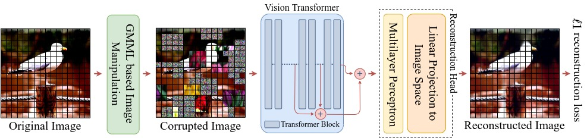

# GMML: Group Masked Model Learning is All you Need



This repository contains the official PyTorch self-supervised pretraining, finetuning, and evaluation codes for GMML is All you Need.

# Usage
- Create an environment
> conda create -n GMML python=3.8
- Activate the environment and install the necessary packages
> conda activate GMML

> conda install pytorch torchvision torchaudio cudatoolkit=11.0 -c pytorch

> pip install -r requirements.txt


# Self-supervised pre-training
> python -m torch.distributed.launch --nproc_per_node=4 --use_env main.py --batch-size 64 --epochs 801 

Self-supervised pre-trained models using GMML can be downloaded from [here (soon)]

# Finetuning
> python -m torch.distributed.launch --nproc_per_node=4 --use_env main.py  --batch-size 64 --epochs 801 

**Note: assign the --dataset_location parameter to the location of the downloaded dataset**

If you use this code for a paper, please cite:

```
@article{atito2021sit,

  title={GMML is All you Need},

  author={Atito, Sara and Awais, Muhammad and Kittler, Josef},

  journal={},

  year={2022}

}
```


# License
This repository is released under the GNU General Public License.


